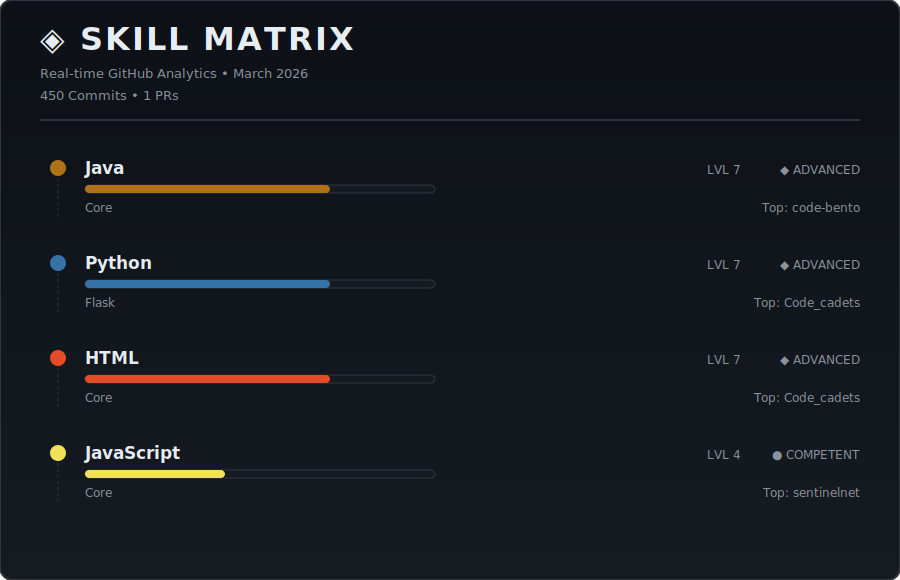
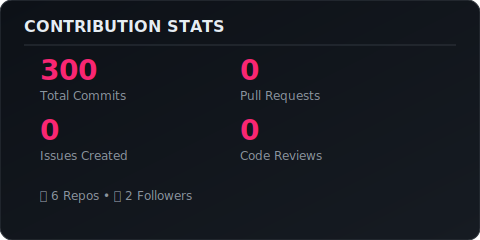
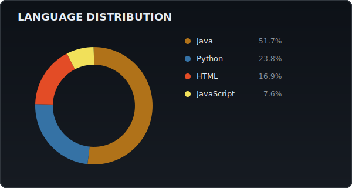

<div align="center">

# 👋 Hey, I'm Vedant Singh


[](https://github.com/Vedant1434)
[](https://github.com/Vedant1434?tab=followers)
[](https://github.com/Vedant1434?tab=repositories)

</div>

---

## 🎯 About Me

```java
public class VedantSingh {

    String identity = "Software Engineer by mindset, not by title";

    String[] IBuild = {
        "Anything that solves a real problem",
        "Systems, tools, libraries, and experiments",
        "Projects driven by curiosity, not roles"
    };

    String[] toolsIUse = {
        "Java", "Python", "Spring Boot", "Databases",
        "APIs", "Automation", "Whatever the idea needs"
    };

    String[] currentlyExploring = {
        "Microservices",
        "Docker & Containers",
        "Cloud & Distributed Systems",
        "Machine learning and AI"
    };

    String philosophy =
        "Ideas come first. Tech follows. Engineering makes it real.";

    void intro() {
        System.out.println("Hey 👋 I'm Vedant");
        System.out.println("I build things because I enjoy engineering.");
        System.out.println("If I can imagine it, I try to implement it.");
    }

    public static void main(String[] args) {
        new VedantSingh().intro();
    }
}
---
```
## 🎮 Dynamic Skill Matrix

> **Real-time analytics**

<div align="center">
  
</div>

### 🧬 Tech DNA

The skill matrix above analyzes:
- 📊 **Language proficiency** based on code volume and project complexity
- 🔧 **Framework detection** through deep repository scanning
- 📈 **Activity scoring** with recency weighting
- ⭐ **Contribution impact** including PRs, issues, and reviews

---

## 📊 Analytics Dashboard

<div align="center">
  
### Contribution Stats


### Language Distribution


</div>

---
## 🛠️ Tech Stack

<div align="center">

### 💻 Programming Languages


### ⚙️ Backend Technologies


### 🧩 Frontend Technologies


### 🗄️ Databases & Caching


### 🐳 DevOps & Architecture (Learning & Hands-on)


### 🧪 Testing & Quality


### 🧰 Tools & Platforms


### 🧠 Other Skills


</div>

---

## 🚀 Featured Projects

> 💡 **Explore more** in my [repositories](https://github.com/Vedant1434?tab=repositories)

---

## 🤝 Let's Connect

<div align="center">

Feel free to reach out! I'm always open to discussing new projects, creative ideas, or opportunities to be part of your visions.

</div>

---

## 💡 Fun Facts

🎮 When I'm not coding, you might find me:
- 📚 Reading tech blogs and documentation
- 🏃‍♂️ Staying active and exploring outdoors
- 🎵 Listening to music while debugging
- 🧩 Solving algorithmic challenges
- 🌱 GAMING
---

### 📬 Open to Opportunities

💼 **Available for:** Backend Engineering roles, Technical Consulting, Open Source Collaboration  
📧 **Contact:** Feel free to reach out via GitHub

---


**Thanks for visiting!** ⭐ Star some repositories if you find them interesting!

</div>

---

<div align="center">
  <sub>Built with ❤️ by Vedant Singh </sub>
</div>
