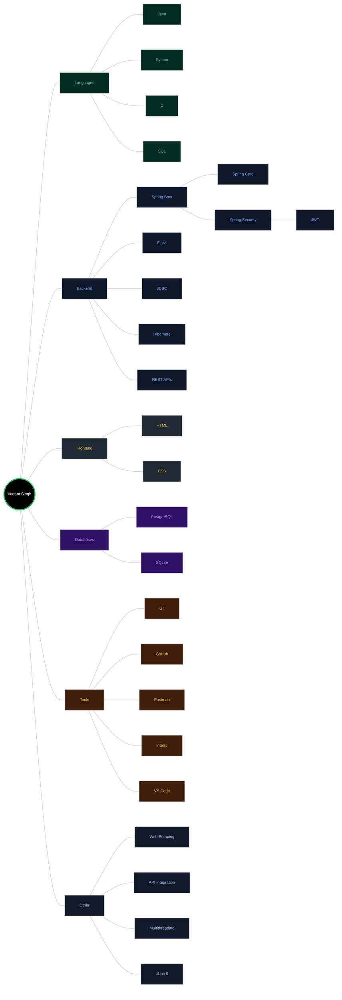

<div align="center">

# 👋 Hey, I'm Vedant Singh


[](https://github.com/Vedant1434)
[](https://github.com/Vedant1434?tab=followers)
[](https://github.com/Vedant1434?tab=repositories)

</div>

---

## 🎯 About Me

```java
public class VedantSingh {
    private String role;
    private String[] focus;
    private String[] languages;
    private String[] currentLearning;
    private String philosophy;

    public VedantSingh() {
        this.role = "Software Engineer";
        this.focus = new String[]{"Backend Development", "System Design", "API Architecture"};
        this.languages = new String[]{"Java", "Python", "JavaScript", "TypeScript"};
        this.currentLearning = new String[]{"Microservices", "Cloud Architecture", "DevOps"};
        this.philosophy = "Code with purpose, build with passion";
    }

    public void sayHi() {
        System.out.println("Thanks for dropping by! Let's build something amazing together 🚀");
    }

    public static void main(String[] args) {
        VedantSingh me = new VedantSingh();
        me.sayHi();
    }
}
---
```
## 🎮 Dynamic Skill Matrix

> **Real-time analytics** automatically generated from my GitHub activity. Updated daily via GitHub Actions.

<div align="center">
  
</div>

### 🧬 Tech DNA

The skill matrix above analyzes:
- 📊 **Language proficiency** based on code volume and project complexity
- 🔧 **Framework detection** through deep repository scanning
- 📈 **Activity scoring** with recency weighting
- ⭐ **Contribution impact** including PRs, issues, and reviews

---

## 📊 Analytics Dashboard

<div align="center">
  
### Contribution Stats


### Language Distribution


### Activity Heatmap


</div>

---

## 🛠️ Tech Stack

<div align="center">

### Core Languages


### Frameworks & Tools


### Databases


### Development Tools


</div>

---

## 📈 GitHub Stats

<div align="center">
  
  
</div>

<div align="center">
  
</div>

<div align="center">
  
</div>

---

## 🎯 Current Focus



---

## 🚀 Featured Projects

> 💡 **Explore more** in my [repositories](https://github.com/Vedant1434?tab=repositories)

---

## 🤝 Let's Connect

<div align="center">

Feel free to reach out! I'm always open to discussing new projects, creative ideas, or opportunities to be part of your visions.

</div>

---

## 💡 Fun Facts

🎮 When I'm not coding, you might find me:
- 📚 Reading tech blogs and documentation
- 🏃‍♂️ Staying active and exploring outdoors
- 🎵 Listening to music while debugging
- 🧩 Solving algorithmic challenges
- 🌱 Contributing to open-source projects

---

## 📊 Weekly Development Breakdown

<!--START_SECTION:waka-->
<!--END_SECTION:waka-->

---

<div align="center">

### 🔥 Contribution Snake


---

### ⚡ Profile Power-Ups

This profile features:
- 🤖 **Automated analytics** via GitHub Actions
- 🎨 **Custom SVG visualizations** with real-time data
- 🔍 **Deep repository forensics** for skill detection
- 📊 **Framework recognition** through file analysis
- 🚀 **Daily updates** to keep stats fresh

<sub>Powered by a custom Python engine • <a href="./scripts/generate_skill_tree.py">View Source Code</a></sub>

---

### 📬 Open to Opportunities

💼 **Available for:** Backend Engineering roles, Technical Consulting, Open Source Collaboration  
📧 **Contact:** Feel free to reach out via GitHub

---


**Thanks for visiting!** ⭐ Star some repositories if you find them interesting!

</div>

---

<div align="center">
  <sub>Built with ❤️ by Vedant Singh • Last updated: Auto-generated daily</sub>
</div>
